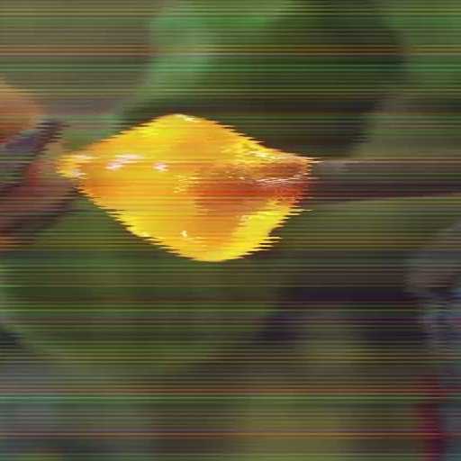

# TAPE (WACV 2024)

### Reference-based Restoration of Digitized Analog Videotapes

[](https://arxiv.org/abs/2310.14926)
[](https://github.com/miccunifi/TAPE)

[](https://paperswithcode.com/sota/analog-video-restoration-on-tape?p=reference-based-restoration-of-digitized)

**🔥 🔥 🔥 [22/12/2023] The pre-trained model and the code for real-world inference, training and testing are now available**

This is the **official repository** of the [**paper**](https://arxiv.org/abs/2310.14926) "*Reference-based Restoration of Digitized Analog Videotapes*".

## Overview

### Abstract

Analog magnetic tapes have been the main video data storage device for several decades. Videos stored on analog videotapes exhibit unique degradation patterns caused by tape aging and reader device malfunctioning that are different from those observed in film and digital video restoration tasks. In this work, we present a reference-based approach for the resToration of digitized Analog videotaPEs (TAPE). We leverage CLIP for zero-shot artifact detection to identify the cleanest frames of each video through textual prompts describing different artifacts. Then, we select the clean frames most similar to the input ones and employ them as references. We design a transformer-based Swin-UNet network that exploits both neighboring and reference frames via our Multi-Reference Spatial Feature Fusion (MRSFF) blocks. MRSFF blocks rely on cross-attention and attention pooling to take advantage of the most useful parts of each reference frame. To address the absence of ground truth in real-world videos, we create a synthetic dataset of videos exhibiting artifacts that closely resemble those commonly found in analog videotapes. Both quantitative and qualitative experiments show the effectiveness of our approach compared to other state-of-the-art methods.

<p align="center">
  
</p>

Overview of the proposed approach. *Left* given a video, we identify the cleanest frames with CLIP. First, we measure the similarity between the frames and textual prompts that describe different artifacts. Then, we employ Otsu's method to define a threshold for classifying the frames based on their similarity scores, resulting in a set of clean frames. *Right* given a window of $T$ degraded input frames, we select the most similar $D$ clean frames based on the CLIP image features and employ them as references. The proposed Swin-UNet then restores the input frames while effectively leveraging the references.

### Dataset

<p align='center'>
  
  
  
</p>

We release a dataset of videos synthetically degraded with Adobe After Effects to exhibit artifacts resembling those of real-world analog videotapes. The original high-quality videos belong to the Venice scene of the Harmonic dataset. The artifacts taken into account are: 1) tape mistracking; 2) VHS edge waving; 3) chroma loss along the scanlines; 4) tape noise; 5) undersaturation. The dataset comprises a total of 26,392 frames corresponding to 40 clips. The clips are randomly divided into training and test sets with a 75%-25% ratio.

The dataset can be downloaded [here](https://drive.google.com/drive/folders/1NjTiXOSf8_FVofvGFBGFwndomjTsThF-?usp=sharing). We release both the ```mp4``` videos and the [LMDB](https://lmdb.readthedocs.io/en/release/) files associated with each split.


## Citation

```bibtex
@misc{agnolucci2023referencebased,
    title={Reference-based Restoration of Digitized Analog Videotapes},
    author={Lorenzo Agnolucci and Leonardo Galteri and Marco Bertini and Alberto Del Bimbo},
    year={2023},
    eprint={2310.14926},
    archivePrefix={arXiv},
    primaryClass={cs.CV}
}
```

<details>
<summary><h2>Getting Started</h2></summary>

### Installation
We recommend using the [**Anaconda**](https://www.anaconda.com/) package manager to avoid dependency/reproducibility
problems. For Linux systems, you can find a conda installation guide [here](https://docs.conda.io/projects/conda/en/latest/user-guide/install/linux.html).

1. Clone the repository

```sh
git clone https://github.com/miccunifi/TAPE
```

2. Install Python dependencies

```sh
conda create -n TAPE -y python=3.10
conda activate TAPE
cd TAPE
chmod +x install_requirements.sh
./install_requirements.sh
```

3. (Optional) If you want to compute the [VMAF](https://github.com/Netflix/vmaf) score, you first need to install [ffmpeg](https://ffmpeg.org/).
Then, follow the instructions reported [here](https://github.com/Netflix/vmaf/blob/master/resource/doc/python.md) to install
the VMAF Python library. Finally, place the ```vmaf``` folder inside the ```utils``` directory.


### Data Preparation

Download the dataset from [here](https://drive.google.com/drive/folders/1NjTiXOSf8_FVofvGFBGFwndomjTsThF-?usp=sharing). 
At the end, the directory structure should look like this:

```
├── data_base_path
|
|    ├── train
|    |   ├── input
|    |   |   ├── input.lmdb
|    |   |   ├── videos
|    |   ├── gt
|    |   |   ├── gt.lmdb
|    |   |   ├── videos
|
|    ├── test
|    |   ├── input
|    |   |   ├── input.lmdb
|    |   |   ├── videos
|    |   ├── gt
|    |   |   ├── gt.lmdb
|    |   |   ├── videos
```
</details>

<details>
<summary><h2>Real-world Inference</h2></summary>

To use our method for restoring a real-world video, download the pre-trained model from the 
[release](https://github.com/miccunifi/TAPE/releases/tag/weights) and place it under
the ```experiments/pretrained_model``` directory. Then, run the following command:

```python
 python real_world_inference.py --input-path <path_to_video> --output-path <path_to_output_folder>
```

```
--input-path <str>                           Path to the video to restore
--output-path <str>                          Path to the output folder
--checkpoint-path <str>                      Path to the pretrained model checkpoint (default=experiments/pretrained_model/checkpoint.pth)
--num-input-frames <int>                     Number of input frames T for each input window (default=5)
--num-reference-frames <int>                 Number of reference frames D for each input window (default=5)
--preprocess-mode <str>                      Preprocessing mode, options: ['crop', 'resize', 'none']. 'crop' extracts the --patch-size center
                                             crop, 'resize' resizes the longest side to --patch-size while keeping the aspect ratio, 'none'
                                             applies no preprocessing  (default=crop)
--patch-size <int>                           Maximum patch size for --preprocess-mode ['crop', 'resize'] (default=512)
    
--frame-format <str>                         Frame format of the extracted and restored frames (default=jpg)
--generate-combined-video <store_true>       Whether to generate the combined video (i.e. input and restored videos side by side)
--no-intermediate-products <store_true>      Whether to delete intermediate products (i.e. input frames, restored frames, references)
--batch-size <int>                           Batch size (default=1)
--num-workers <int>                          Number of workers of the data loader (default=20)
```

</details>

<details>
<summary><h2>Training and Testing</h2></summary>

To train our model from scratch, run the following command:

```python
python main.py --experiment-name <name_of_the_experiment> --data-base-path <data_base_path> --comet-api-key <comet_api_key> --comet-project-name <comet_project_name>
```

You need a [Comet ML](https://www.comet.com/site/) for logging. See ```main.py``` for all the available options. The
checkpoints will be saved inside the ```experiments/<name_of_the_experiment>/checkpoints``` folder. After training, ```main.py```
will run the evaluation on the test set and save the results inside the ```experiments/<name_of_the_experiment>/results``` folder.

If you want to skip the training and just run the evaluation on the test set, add the ```--test-only``` flag to the command
above. In addition, if you want to avoid computing the VMAF score, add the ```--no-vmaf``` flag.

You can test our pre-trained model by adding the ```--eval-type pretrained``` flag. Note that you first need to download the pre-trained model from the
[release](https://github.com/miccunifi/TAPE/releases/tag/weights) and to place it under
the ```experiments/pretrained_model``` directory.

</details>

## Authors

* [**Lorenzo Agnolucci**](https://scholar.google.com/citations?user=hsCt4ZAAAAAJ&hl=en)
* [**Leonardo Galteri**](https://scholar.google.com/citations?user=_n2R2bUAAAAJ&hl=en)
* [**Marco Bertini**](https://scholar.google.com/citations?user=SBm9ZpYAAAAJ&hl=en)
* [**Alberto Del Bimbo**](https://scholar.google.com/citations?user=bf2ZrFcAAAAJ&hl=en)

## Acknowledgements

This work was partially supported by the European Commission under European Horizon 2020 Programme, grant number 101004545 - ReInHerit.

## LICENSE
<a rel="license" href="http://creativecommons.org/licenses/by-nc/4.0/"></a><br />All material is made available under [Creative Commons BY-NC 4.0](https://creativecommons.org/licenses/by-nc/4.0/). You can **use, redistribute, and adapt** the material for **non-commercial purposes**, as long as you give appropriate credit by **citing our paper** and **indicate any changes** that you've made.
